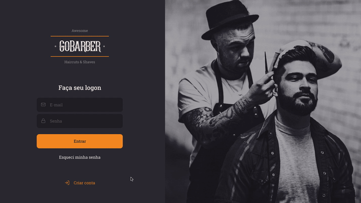

<h4 align="center">
<br>
 <b>✂️ A Fullstack application of a BarberShop</b> 
</h4>

<p align="center">
  

  
  
  
 

 
 
  
</p>

<p >
  
  
</p>

### 💻 Project
Under construction!

## :rocket: Technologies

- [ReactJS](https://reactjs.org/)
- [TypeScript](https://www.typescriptlang.org/)
- [React Native](https://reactnative.dev/)
- [React Native Vector Icons](https://github.com/oblador/react-native-vector-icons)
- [React Router DOM](https://reacttraining.com/react-router/)
- [React Icons](https://react-icons.netlify.com/#/)
- [UnForm](https://unform.dev/) (https://rocketseat.com.br/)
- [Yup](https://github.com/jquense/yup)
- [Express](https://expressjs.com/pt-br/)
- [Multer](https://github.com/expressjs/multer)
- [TypeORM](https://typeorm.io/#/)
- [JWT-token](https://jwt.io/)
- [uuid v4](https://github.com/thenativeweb/uuidv4/)
- [PostgreSQL](https://www.postgresql.org/)
- [Date-fns](https://date-fns.org/)
- [Jest](https://jestjs.io/)
- [Styled Components](https://styled-components.com/)
- [Polished](https://github.com/styled-components/polished)
- [Axios](https://github.com/axios/axios)
- [Eslint](https://eslint.org/)
- [Prettier](https://prettier.io/)
- [EditorConfig](https://editorconfig.org/)

### Prerequisites

Before you begin, you need to have installed the following tools:

<b>[Git](https://git-scm.com)</b>

<b>[Node.js](https://nodejs.org/en/)</b>

<b>[One instance of [PostgreSQL]](https://www.postgresql.org/)</b>

<b>Obs.: I recommend using docker</b>

### 🧭 Running the Backend

```bash
# Clone this repository
$ git clone https://github.com/mschneider86/go-barber

# Access the project folder on terminal/prompt
$ cd go-barber

# Go to backend folder
$ cd backend

# Install the dependencies
$ npm install ou yarn add

# Make a copy of '.env.example' to '.env'
# and set with YOUR environment variables.
# The aws variables do not need to be filled for dev environment
$ cp .env.example .env

# Create the instance of postgreSQL using docker
$ docker run --name gobarber-postgres -e POSTGRES_USER=docker \
              -e POSTGRES_DB=gobarber -e POSTGRES_PASSWORD=docker \
              -p 5432:5432 -d postgres

# Create the instance of mongoDB using docker
$ docker run --name gobarber-mongodb -p 27017:27017 -d -t mongo

# Create the instance of redis using docker
$ docker run --name gobarber-redis -p 6379:6379 -d -t redis:alpine

# Make a copy of 'ormconfig.example.json' to 'ormconfig.json'
# and set the values, if they are not filled,
# to connect with docker database containers
$ cp ormconfig.example.json ormconfig.json

# Once the services are running, run the migrations
$ yarn typeorm migration:run

# Execute the application on dev mode
$ npm run dev ou yarn dev

# The server will start on port:3333 - access it on http://localhost:3333
```

### 🧭 Running the Frontend

```bash
# Clone this repository
$ git clone https://github.com/mschneider86/go-barber

# Access the project folder on terminal/prompt
$ cd go-barber

# Go to frontend folder
$ cd frontend

# Install the dependencies
$ npm install ou yarn add

# Make sure the file 'src/services/api.ts' contains the IP to your API

# Execute the application
$ npm start ou yarn start

# The app will start on port:3000 - access it on http://localhost:3000
```

### 🧭 Running the Mobile

```bash
# Clone this repository
$ git clone https://github.com/mschneider86/go-barber

# Access the project folder on terminal/prompt
$ cd go-barber

# Go to Mobile folder
$ cd mobile

# Install the dependencies
$ npm install ou yarn add

# Make sure the file 'src/services/api.ts' contains the IP to your API

# Start the app
$ expo start

```

## 🤔 How to contribute

- Fork this repo;
- Create a branch with your feature: 'git checkout -b my-feature';
- Commit your changes: `git commit -m 'feat: My new feature'`;
- Push to your branch: 'git push origin my-feature'.
